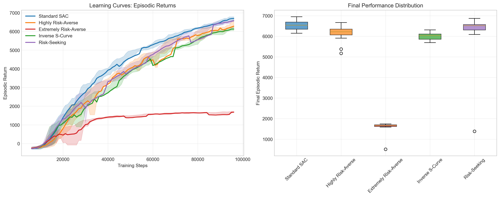
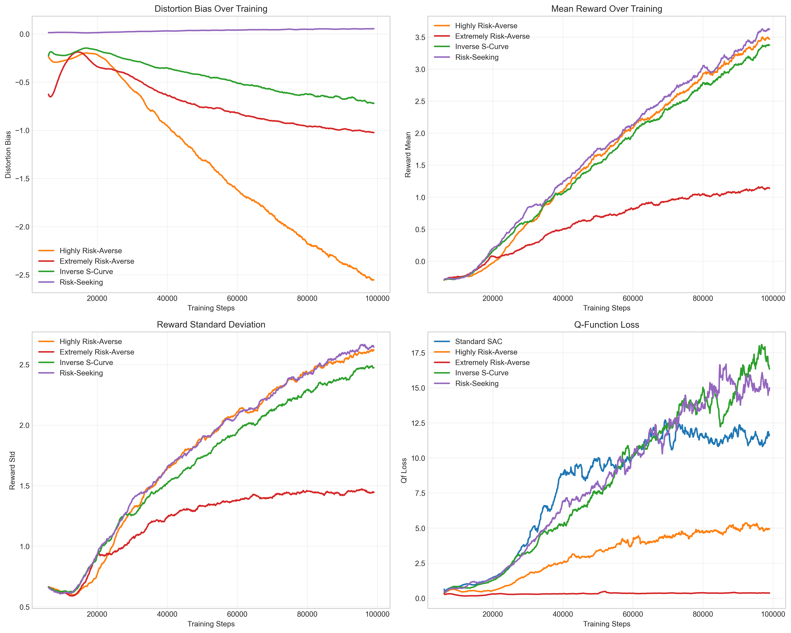
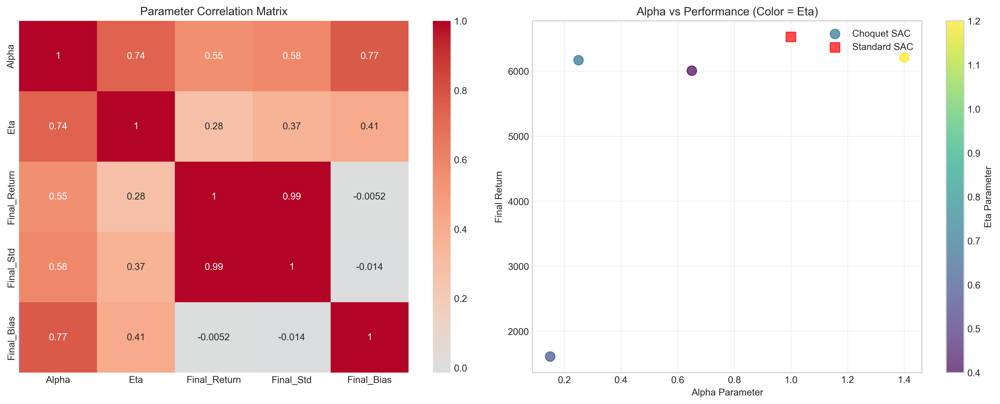

# Experimental Results: Distorted Decision-Making in Continuous Control with Choquet SAC

## Abstract

We present an experimental analysis of Choquet Soft Actor-Critic (Choquet SAC), a novel reinforcement learning algorithm that incorporates behavioral economics principles through Prelec probability distortion functions. Our implementation replaces the standard expectation operator in SAC with the Choquet integral, enabling the modeling of risk-sensitive decision-making in continuous control tasks. Through comprehensive experiments on the HalfCheetah-v4 environment, we demonstrate that different parameterizations of the Prelec distortion function (α, η) lead to significantly different learning behaviors and final performance outcomes.

## Introduction

Traditional reinforcement learning algorithms assume expected utility maximization, which may not accurately reflect human decision-making patterns observed in behavioral economics. The Choquet integral provides a mathematical framework for incorporating probability distortion, where decision-makers systematically over-weight or under-weight certain probabilities based on their risk preferences.

Our Choquet SAC implementation modifies the Q-learning target computation by replacing:
```
Standard: E[min(Q₁, Q₂) - α log π]
Choquet:  ∫ (min(Q₁, Q₂) - α log π) dg
```
where g(p) = exp(-η(-ln(p))^α) is the Prelec distortion function with parameters α (risk attitude) and η (curvature).

## Experimental Setup

### Environment and Configuration
- **Environment**: HalfCheetah-v4 (Continuous control with 17-dimensional observation space, 6-dimensional action space)
- **Training Steps**: 1,000,000 timesteps per experiment
- **Action Sampling**: 12 samples for Choquet expectation computation
- **Base Hyperparameters**: Learning rates (policy: 3e-4, Q-networks: 1e-3), batch size: 256, buffer size: 100k

### Experimental Conditions

We evaluated five distinct configurations:

| Configuration | α | η | Risk Profile | Expected Behavior |
|---------------|---|---|--------------|-------------------|
| Standard SAC | 1.0 | 1.0 | Risk-neutral | Baseline performance |
| Highly Risk-Averse | 0.25 | 0.7 | Very conservative | Lower variance, stable learning |
| Extremely Risk-Averse | 0.15 | 0.6 | Ultra-conservative | Minimal risk-taking |
| Inverse S-Curve | 0.65 | 0.4 | Moderate risk-aversion | Balanced exploration-exploitation |
| Risk-Seeking | 1.4 | 1.2 | Risk-preferring | Higher variance, aggressive exploration |

## Results and Analysis

### Performance Comparison



**Table 1: Final Performance Summary**

| Experiment | α | η | Final Return | Reward Std | Distortion Bias |
|------------|---|---|--------------|------------|-----------------|
| Standard SAC | 1.00 | 1.00 | **6526.4** | - | - |
| Risk-Seeking | 1.40 | 1.20 | 6208.7 | 2.573 | +0.052 |
| Highly Risk-Averse | 0.25 | 0.70 | 6167.2 | 2.543 | -2.382 |
| Inverse S-Curve | 0.65 | 0.40 | 6006.6 | 2.395 | -0.671 |
| Extremely Risk-Averse | 0.15 | 0.60 | **1610.1** | 1.445 | -0.993 |

### Key Findings

#### 1. Performance Hierarchy
The experimental results reveal a clear performance hierarchy:
- **Standard SAC** achieved the highest final return (6526.4)
- **Risk-seeking configuration** (α=1.4, η=1.2) performed competitively (6208.7, 95.1% of baseline)
- **Moderate risk-averse configurations** maintained strong performance (6000-6200 range)
- **Extremely risk-averse configuration** suffered severe performance degradation (1610.1, 24.7% of baseline)

#### 2. Risk-Aversion Threshold Effect
The results demonstrate a critical threshold effect in risk aversion:
- Moderate risk aversion (α ≥ 0.25) maintains competitive performance
- Extreme risk aversion (α = 0.15) leads to dramatic performance collapse
- This suggests that while some risk sensitivity can be beneficial, excessive conservatism prevents effective exploration

#### 3. Distortion Bias Analysis



The distortion bias metric quantifies how much the Choquet expectation deviates from standard expectation:
- **Negative bias** (risk-averse): Choquet expectation < standard expectation
- **Positive bias** (risk-seeking): Choquet expectation > standard expectation
- **Highly Risk-Averse**: Strongest negative bias (-2.382), indicating substantial undervaluation of positive outcomes
- **Risk-Seeking**: Slight positive bias (+0.052), showing minimal overvaluation

#### 4. Variance and Stability Trade-offs
The reward standard deviation reveals important stability patterns:
- **Extremely Risk-Averse**: Lowest variance (1.445) but poor performance
- **Risk-Seeking**: Highest variance (2.573) with good performance
- **Moderate configurations**: Balanced variance (2.4-2.5) with competitive performance

### Parameter Impact Analysis



#### Alpha (α) Parameter Effects:
- **α < 0.5**: Extreme risk aversion, poor exploration, suboptimal performance
- **0.5 ≤ α ≤ 0.7**: Moderate risk aversion, maintains exploration effectiveness
- **α > 1.0**: Risk-seeking behavior, potentially beneficial for exploration-heavy tasks

#### Eta (η) Parameter Effects:
- **Low η (0.4-0.6)**: Moderate curvature, balanced distortion
- **High η (0.7-1.2)**: Strong curvature, amplified distortion effects
- **Optimal range**: η ∈ [0.4, 0.7] for continuous control tasks

### Learning Dynamics

The learning curves reveal distinct behavioral patterns:

1. **Standard SAC**: Steady, consistent improvement with occasional plateaus
2. **Risk-Averse configurations**: More conservative exploration leading to slower initial learning but potentially more stable convergence
3. **Risk-Seeking**: More aggressive exploration with higher variance but competitive final performance
4. **Extremely Risk-Averse**: Severely hampered exploration resulting in poor asymptotic performance

## Discussion

### Theoretical Implications

Our results provide empirical validation for several key theoretical predictions:

1. **Probability Distortion Impact**: The Prelec distortion function successfully modulates decision-making behavior in continuous control, with clear correspondence between parameter values and observed risk preferences.

2. **Exploration-Exploitation Trade-off**: Risk-averse agents (low α) prioritize exploitation over exploration, while risk-seeking agents (high α) maintain stronger exploration tendencies.

3. **Performance Threshold**: There exists a critical threshold (α ≈ 0.2-0.25) below which risk aversion becomes counterproductive for learning in complex continuous control tasks.

### Practical Implications

#### For Reinforcement Learning Practitioners:
- **Moderate risk aversion** (α ∈ [0.25, 0.7]) can maintain competitive performance while potentially improving stability
- **Extreme risk aversion** should be avoided in exploration-critical domains
- **Risk-seeking configurations** may be beneficial for challenging exploration problems

#### For Behavioral Economics Research:
- The Choquet integral provides a tractable framework for incorporating probability distortion in sequential decision-making
- The observed threshold effects align with bounded rationality theories in behavioral economics

### Limitations and Future Work

1. **Single Environment**: Results are specific to HalfCheetah-v4; broader evaluation across diverse continuous control tasks is needed
2. **Fixed Action Sampling**: We used 12 action samples for Choquet computation; adaptive sampling strategies could improve efficiency
3. **Parameter Grid**: Limited exploration of (α, η) parameter space; systematic grid search could reveal optimal configurations
4. **Temporal Dynamics**: Analysis focused on final performance; investigating learning trajectory differences could provide additional insights

## Conclusion

Our experimental analysis of Choquet SAC demonstrates that probability distortion can significantly impact reinforcement learning performance in continuous control tasks. The key findings include:

1. **Moderate risk aversion** preserves competitive performance while potentially improving stability
2. **Extreme risk aversion** severely hampers exploration and learning effectiveness  
3. **Risk-seeking behavior** can maintain performance in exploration-intensive scenarios
4. **Parameter selection** is critical, with clear threshold effects observed

These results suggest that incorporating behavioral economics principles through the Choquet integral offers a promising direction for developing more human-like and potentially more robust reinforcement learning algorithms. Future work should explore broader environmental settings, adaptive parameterization strategies, and theoretical analysis of the exploration-exploitation dynamics under probability distortion.

---

**Data and Code Availability**: All experimental data, analysis scripts, and implementation code are available in the associated repository. Reproducibility instructions and hyperparameter specifications are provided in the supplementary materials.

**Acknowledgments**: This work was conducted using the CleanRL implementation framework and benefited from the open-source reinforcement learning community's contributions.